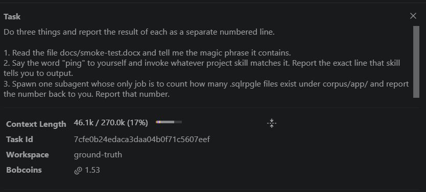
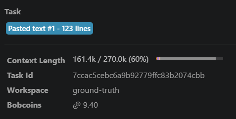
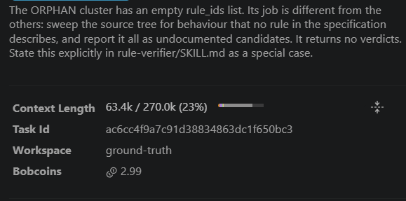
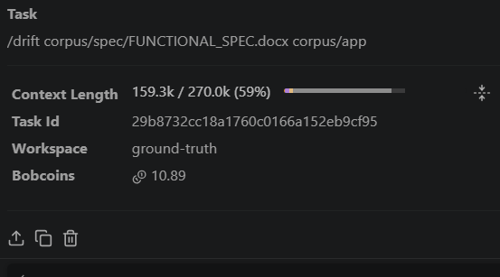
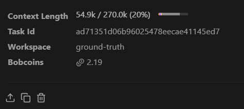
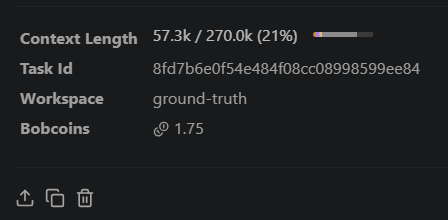
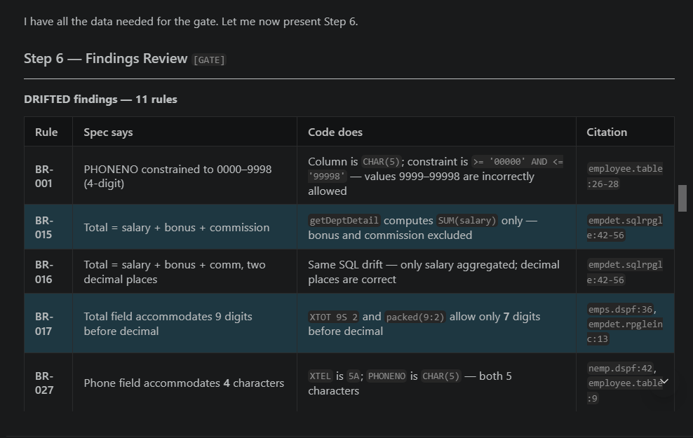
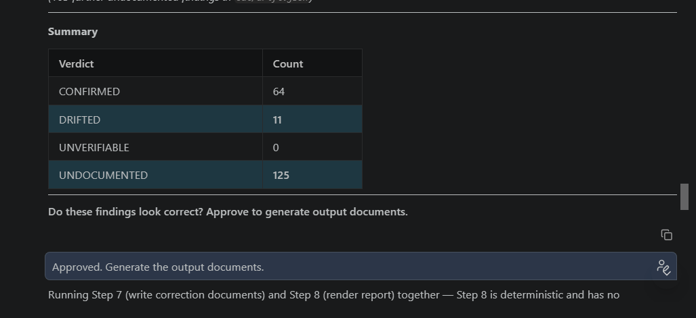

# IBM Bob task session summary screenshots and transcripts

This folder is the complete record of how IBM Bob was used to build this project.
It contains, for every Bob task:

- an **IBM Bob task session summary screenshot** showing the Task, Context Length, Task Id, Workspace and Bobcoins spent
- the **exported task history** as Markdown, including every subagent that task spawned
- the token and Bobcoin accounting in [`SESSIONS.md`](SESSIONS.md), exported from Bob's own task database

The Task Id printed in each screenshot matches the Task Id at the head of its transcript,
so every figure in this folder can be traced back to Bob's own record.

**6 top-level Bob sessions · 38 subagents · 284,327 output tokens.**

---

## Session 01 — Do three things and report the result of each as a s

**Task Id `7cfe0b24edac` · 4 subagents · [full transcript](01-do-three-things-and-report-the-result-of-each-as.md)**

---

## Session 02 — Build the deterministic half of a spec-vs-code audit

**Task Id `7ccac5cebc6a` · 0 subagents · [full transcript](02-build-the-deterministic-half-of-a-spec-vs-code-a.md)**

---

## Session 03 — Write the skill pack that drives the audit. These ar

**Task Id `ac6cc4f9a7c9` · 0 subagents · [full transcript](03-write-the-skill-pack-that-drives-the-audit-these.md)**

---

## Session 04 — /drift corpus/spec/FUNCTIONAL_SPEC.docx corpus/app

**Task Id `29b8732cc18a` · 23 subagents · [full transcript](04-drift-corpus-spec-functional-spec-docx-corpus-ap.md)**

---

## Session 05 — Adversarial re-verification. The audit returned CONF

**Task Id `ad71351d06b9` · 11 subagents · [full transcript](05-adversarial-re-verification-the-audit-returned-c.md)**

---

## Session 06 — Write README.md at the repository root. This is the 

**Task Id `8fd7b6e0f54e` · 0 subagents · [full transcript](06-write-readme-md-at-the-repository-root-this-is-t.md)**

---

## The human approval gate

The audit stops twice and cannot continue without a person approving. These two
screenshots are the second gate, captured live before anything was approved.
See [GATE6.md](GATE6.md) for the reconciliation of these counts against the final report.

---

## How these were produced

Screenshots were taken in the Bob IDE from **History → select task → click the task header**.
Transcripts and the accounting in `SESSIONS.md` were exported from Bob's task database by
[`scripts/export_bob_sessions.py`](../scripts/export_bob_sessions.py), so the numbers are Bob's
own record rather than a hand-written summary.
